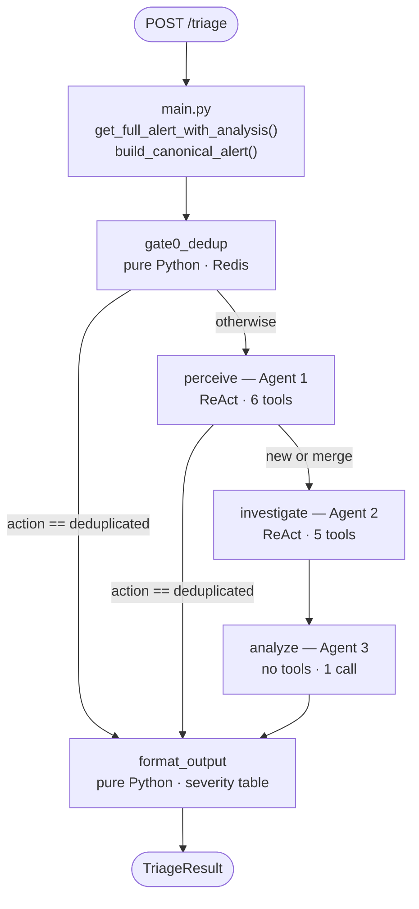
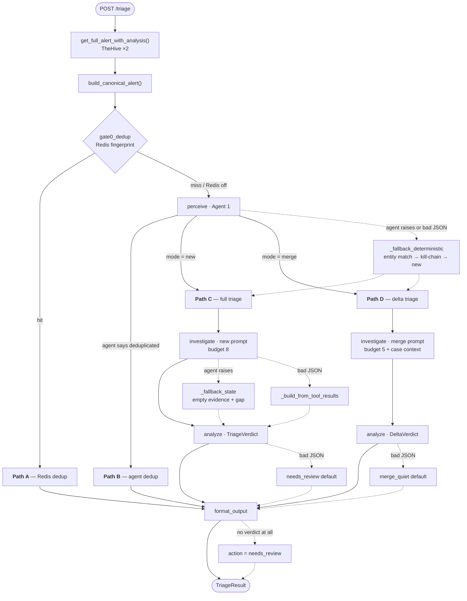

# Agent-Service — Architecture & Capability Reference

**What this document is.** The full designed architecture of `agent-service`, derived from the
code. For every agent: the tools it holds, the API each tool reaches, the exact request it
issues, and the shape it is expected to return. Plus every path an alert can take, and every
piece of enrichment the system gathers.

**What this document is not.** A status report. Nothing here says whether a backend is
currently reachable or whether a given field comes back populated in production. Operational
findings live in `PIPELINE-AUDIT.md`.

Every claim below cites `file:line`. Where this document and the code disagree, the code wins.

---

## Table of contents

1. [What the service is](#1-what-the-service-is)
2. [Contracts — in and out](#2-contracts--in-and-out)
3. [Graph topology and shared state](#3-graph-topology-and-shared-state)
4. [Agent 1 — Perceive](#4-agent-1--perceive)
5. [Agent 2 — Investigate](#5-agent-2--investigate)
6. [Agent 3 — Analyze](#6-agent-3--analyze)
7. [Non-agent nodes](#7-non-agent-nodes)
8. [Backend reference — one section per system](#8-backend-reference--one-section-per-system)
9. [Alert normalization — `alert_builder.py`](#9-alert-normalization--alert_builderpy)
10. [Every path an alert can take](#10-every-path-an-alert-can-take)
11. [Enrichment inventory — what, from where, expected return](#11-enrichment-inventory--what-from-where-expected-return)
12. [The write path — `case_action.py`](#12-the-write-path--case_actionpy)
13. [Configuration reference](#13-configuration-reference)
14. [Invariants](#14-invariants)

---

## 1. What the service is

A LangGraph-powered FastAPI service that automates SOC alert triage. It sits between **n8n**
(deterministic ingestion, not in this repo) and the security stack.

```
Security Onion ──► n8n ──► TheHive alert + observables + Cortex jobs
                    │
                    └──► POST /triage {thehive_alert_id, raw_alert, asset_context}
                              │
                         agent-service  ── reads 6 backends, runs 3 LLM agents
                              │
                              └──► TriageResult {action, severity, verdict, evidence, trace}
                                        │
                                   n8n executes the action against TheHive
```

### Division of responsibility

| Concern | Owner |
|---|---|
| Create the TheHive alert, attach observables, trigger Cortex | **n8n**, before `/triage` |
| Normalize raw alert → `CanonicalAlert` | **agent-service** (`alert_builder.py`) |
| Correlate, investigate, decide | **agent-service** (the three agents) |
| Compute severity | **agent-service** (`format_output.py`, table lookup — never the LLM) |
| Execute the case action in TheHive | **n8n** (or `case_action.py` post-approval) |

The service is **read-only by construction**. Every tool registered to every agent is a read.
The only write-capable module (`nodes/case_action.py`) is deliberately not wired into the graph.

---

## 2. Contracts — in and out

### Input — `AlertWebhookPayload` (`schemas.py:99`)

```jsonc
{
  "thehive_alert_id": "~1190993992",   // required — the alert n8n already created
  "raw_alert":       { ... },          // required — the raw Security Onion document
  "asset_context":   { ... }           // optional — anything n8n already knows about the host
}
```

Deliberately slim: n8n passes an ID and the raw document; the service fetches everything else
itself (`main.py:38`).

### Output — `TriageResult` (`schemas.py:170`)

```jsonc
{
  "alert_id": "...",
  "action": "create_case | close_fp | needs_review | merge_quiet | merge_and_retier | deduplicated",
  "verdict": "true_positive | false_positive | needs_review | null",
  "severity": "low | medium | high | critical | null",   // computed, never model-generated
  "likelihood": "unlikely | possible | likely | near_certain | null",
  "impact_if_true": "minor | moderate | severe | critical | null",
  "mitre_mapping": [{ "tactic", "technique", "sub_technique", "confidence", "basis" }],
  "reasoning": "...",
  "summary": "...",
  "merge_into_case": "...|null",
  "severity_change": "medium -> high | no_change | null",
  "urgency": "escalate | routine_merge | null",
  "evidence_package": { ... },        // full evidence, for the analyst
  "investigation_trace": [ ... ],     // every tool call: name, params, result summary
  "correlation_result": { ... }
}
```

`action` is what n8n switches on. `investigation_trace` is the audit record of every tool the
agents actually called.

### Endpoints (`main.py`)

| Method | Path | Purpose |
|---|---|---|
| `GET` | `/health` | Liveness — `{status, timestamp, service}` |
| `POST` | `/triage` | The pipeline. Returns `TriageResult`. |

---

## 3. Graph topology and shared state

`graph.py:26-51` — a `StateGraph` with two conditional edges.



### `TriageState` (`schemas.py:188`) — the single dict threaded through every node

| Key | Written by | Read by |
|---|---|---|
| `canonical_alert` | `main.py` → initial state | gate0, perceive, investigate, format_output |
| `mode` (`new` \| `merge`) | gate0, perceive | investigate, analyze, format_output |
| `correlation_result` | gate0, perceive | routers, format_output |
| `mitre_mapping` | perceive | analyze |
| `existing_case_context` | perceive | investigate, analyze |
| `evidence_package` | investigate (new) | analyze, format_output |
| `delta_evidence` | investigate (merge) | analyze, format_output |
| `triage_verdict` | analyze (new) | format_output |
| `delta_verdict` | analyze (merge) | format_output |
| `triage_result` | format_output | `main.py` response |

Each node reads what it needs and writes its own fields back. No node mutates another's output.

---

## 4. Agent 1 — Perceive

`nodes/perceive.py:140` · prompt `prompts/perceiver.py`

| Property | Value | Source |
|---|---|---|
| Type | `create_react_agent` (LangGraph prebuilt) | `perceive.py:154` |
| Model | `settings.llm_model` @ `settings.llm_base_url` | `perceive.py:21-26` |
| Temperature | `0.0` | `perceive.py:25` |
| Tool budget | `PERCEPTION_MAX_TOOL_CALLS = 7` → `recursion_limit = 7*4+15 = 43` | `perceive.py:28,165` |
| Prompt budget | "at most 6 tool calls" | `perceiver.py:25` |
| Input | Full `CanonicalAlert` JSON | `perceive.py:160` |
| Output | JSON `{mitre_mapping[], correlation_result{}}` | `perceiver.py:100-112` |

### Mission

Three jobs, in order (`perceiver.py:5-14`):

1. Infer MITRE ATT&CK technique mapping — including when no explicit `attack.t####` tag exists.
2. Decide **merge into an existing open case** vs. **start a new one**.
3. If a merge candidate exists, judge whether it is a **kill-chain progression** (a later MITRE
   tactic than the case already documents) or just infrastructure noise.

### Tools — `PERCEPTION_TOOLS` (`registry.py:197`)

| # | Tool | Reaches | Expected return |
|---|---|---|---|
| 1 | `get_fp_signal(rule_uuid, host)` | Local SQLite | `{short_term_fp_rate, long_term_fp_rate, short_term_total, long_term_total}` |
| 2 | `thehive_fp_history(rule_uuid, host, limit=3)` | TheHive `/api/v1/query` | `[{alert_id, title, comment, closed_at}]` — or `[]` if under threshold |
| 3 | `detection_rule_lookup(rule_uuid, source_engine?)` | Elasticsearch `so-detection` | Rule source + MITRE metadata (below) |
| 4 | `qdrant_retrieve_mitre(query_text, top_k=5)` | Qdrant `triage_kb` | `[{score, tactic, technique, technique_id, sub_technique, description}]` |
| 5 | `thehive_open_cases(observables, host, user)` | TheHive `/api/v1/query` | `[{case_id, title, severity, status, tags, description, host, user, observables, created_at}]` |
| 6 | `get_case_full(case_id)` | TheHive `GET /api/v1/case/{id}` | `{case_id, title, description, severity, status, tags, metrics, custom_fields, created_at, owner, summary}` |

**Tool 1 — `get_fp_signal`** (`fp_tracking.py:67`). Local, instant, no network. Two windows,
not one running total: 24h (active-incident noise) and 30d (chronic baseline noise). The prompt
directs it to be called **first, always** — it's free.

**Tool 2 — `thehive_fp_history`** (`fp_tracking.py:93`). Gated **in code**, not just in the
prompt: returns `[]` without touching TheHive unless `long_term_fp_rate > 0.5` **and**
`long_term_total >= 5` (`fp_tracking.py:102`). Speculative calls therefore cost nothing.

**Tool 3 — `detection_rule_lookup`** (`detection_rules.py:41`). One query against Security
Onion's `so-detection` index, which holds native rule source for all three engines keyed by
`so_detection.publicId` (Sigma UUID / Suricata SID / YARA rule name). Expected shape:

```jsonc
{
  "found": true, "source_engine": "sigma", "engine": "...", "public_id": "...",
  "title": "...", "description": "...", "severity": "...", "author": "...",
  "category": "...", "is_enabled": true, "ruleset": "...", "product": "...",
  // language-specific:
  "mitre_attack": ["T1105"], "mitre_tactics": ["command-and-control"],
  "mitre_groups": [], "mitre_software": [], "mitre_technique_names": [],
  "falsepositives": ["Unknown"], "level": "high", "references": [],
  "status": "...", "date": "...", "modified": "...", "logsource": {}
}
```

Per-language parsing (`detection_rules.py:84-94`):
- **Sigma** → YAML-parse `content`, split `attack.*` tags into four namespaces:
  `attack.t####[.###]` → technique, `attack.g####` → group, `attack.s####` → software,
  anything else → tactic string (`detection_rules.py:111`). Also yields `falsepositives`,
  `level`, `references`, `logsource`.
- **Suricata** → regex `msg:"…"` for title and `metadata:…;` for MITRE key/values; collects
  **all** values per key, not just the last (`detection_rules.py:178-188`).
- **YARA** → always empty MITRE, with an explanatory `note`. Not an error — YARA has no
  native tagging convention (`detection_rules.py:207`).

The prompt is explicit that a MITRE miss is **common and not an error**, and that for Suricata
the `rule_uuid` is the SID — a lookup key, never a technique ID (`perceiver.py:49-50`).

**Tool 4 — `qdrant_retrieve_mitre`** — the designed **fallback** when tool 3 returns no usable
`mitre_attack`, and the source of tactic-ordering context for kill-chain reasoning.

**Tools 5 + 6 — case correlation.** `thehive_open_cases` returns a shallow list; the prompt
requires `get_case_full` before deciding merge, because the shallow list is "not enough to
reason about match strength or kill-chain progression" (`perceiver.py:64-69`).

### Correlation reasoning rules (prompt-level, `perceiver.py:19-24`)

| Signal | Weight |
|---|---|
| Shared common domain (`github.com`, `8.8.8.8`, CDNs) | Noise — ignore unless corroborated |
| Shared **rare hash** | Strong — near-certain same-threat |
| Shared hostname + <24h proximity | Medium confidence |
| Shared hostname, >7 day gap | Low — investigate, don't merge on hostname alone |

Confidence governs the action, not just the label (`perceiver.py:117-120`):
`high` → merge · `medium` → merge but flag for review · `low` → **do not merge**, emit `new`
and name the candidate case in `reason`.

### FP guardrail (`perceiver.py:87-94`)

A high FP rate is "a strong prior, not a verdict." It informs scrutiny; it must never
short-circuit correlation or MITRE mapping.

### Deterministic fallback — `_fallback_deterministic` (`perceive.py:204`)

Fires when the ReAct agent raises (`perceive.py:167`) or its final message doesn't parse as
JSON (`perceive.py:175`). **It calls backends directly, without the LLM:**

1. `_find_merge_candidate` (`perceive.py:249`) — `search_open_cases(observables, host, user)`;
   first hit becomes the merge target → `mode=merge`, reason `entity_match`.
2. `_find_story_match` (`perceive.py:275`) — `get_rule_source(uuid, engine)` for the alert's
   techniques, `search_open_cases(host)` for candidates, then `_is_kill_chain_progression`
   (`perceive.py:89`): map both technique sets through `TECHNIQUE_TO_TACTIC` (61 entries,
   `perceive.py:49`), and merge only if the alert's tactic is **later** in the 14-stage
   `TACTIC_ORDER` (`perceive.py:32`) than anything the case already documents.
3. Neither → `mode=new`.

The fallback sets `mitre_mapping = []` by design — MITRE inference genuinely needs the LLM, and
an empty mapping is the honest degraded state rather than a guess (`perceive.py:206`).

---

## 5. Agent 2 — Investigate

`nodes/investigate.py:25` · prompt `prompts/investigator.py`

| Property | Value | Source |
|---|---|---|
| Type | `create_react_agent` | `investigate.py:36` |
| Model | `settings.llm_model` @ `settings.llm_base_url` | `investigate.py:17-22` |
| Temperature | `0.0` | `investigate.py:21` |
| Tool budget (new) | `MAX_TOOL_CALLS_NEW = 8` → `recursion_limit = 47` | `investigate.py:34,64` |
| Tool budget (merge) | `MAX_TOOL_CALLS_MERGE = 5` → `recursion_limit = 35` | same |
| Prompt | `build_prompt(profile, mode)` — base + profile block + mode block | `investigator.py:118` |
| Output | `EvidencePackage` JSON (new) or `DeltaEvidence` JSON (merge) | `investigator.py:55-76` |

### Input assembly (`investigate.py:42-59`)

Three parts, concatenated:
1. The full `CanonicalAlert` JSON.
2. **If** the alert carries pre-fetched Cortex results — an explicit "do NOT call
   `cortex_analyze` on these observables again" block listing them (`investigate.py:50-54`).
3. **If** `mode == merge` — the `existing_case_context` from Agent 1.

### Tools — `INVESTIGATION_TOOLS` (`registry.py:206`)

| # | Tool | Reaches | Expected return |
|---|---|---|---|
| 1 | `itop_asset_lookup(hostname)` | iTop REST | `{found, hostname, criticality, status, location, organization, contacts, services, description, network_zone}` |
| 2 | `elasticsearch_query(index_type, host, user, iocs, window_hours)` | Elasticsearch — 3 indices | List of event summaries (per mode, below) |
| 3 | `thehive_search_closed(observables, rule_uuid)` | TheHive `/api/v1/query` | `[{case_id, title, severity, status, tags, resolution, summary, created_at}]` |
| 4 | `qdrant_retrieve(collection, query_text, top_k=5)` | Qdrant `triage_kb` | Playbook or CVE matches |
| 5 | `cortex_analyze(observable_type, observable_value)` | Cortex — 3-call sequence | `{observable, type, verdict, score, details, analyzer, raw}` |

**Tool 2 — `elasticsearch_query`** dispatches on `index_type` (`registry.py:78-86`):

| `index_type` | Index pattern | Filters | Returns per hit |
|---|---|---|---|
| `alerts` (default) | `.ds-logs-detections.alerts-so-*` | time window + host/user/IOC `multi_match` | `timestamp, rule_name, rule_uuid, severity, src_ip, dst_ip, hostname, username, category` |
| `process` | `.ds-logs-endpoint.process-*` | time window + host/user; requires at least one | `timestamp, hostname, user, process_name, process_path, command_line, pid` |
| `connections` | `.ds-logs-network.flow-*` | time window + `src_ip`/`dst_ip` terms | `timestamp, src_ip, dst_ip, src_port, dst_port, protocol, bytes, action, hostname` |

Defaults: `window_hours = 24`, `size = 50`, sorted `@timestamp desc`
(`elasticsearch.py:10-11`). For `connections`, the first IOC becomes `src_ip` and the second
`dst_ip` (`registry.py:83-85`).

**Tool 5 — `cortex_analyze`** is deliberately positioned as a **fallback**, for IOCs Agent 2
discovers itself that weren't on the original alert (`investigator.py:30-32`).

### Cortex discipline (`investigator.py:34-40`)

1. Check `canonical_alert.cortex_results` first — the alert already carries reports pulled
   from TheHive.
2. Only call `cortex_analyze` for IOCs with no existing report.
3. Skip common infrastructure entirely (github.com, 8.8.8.8, major CDNs) — record
   `"skipped: common infrastructure"` in `investigation_gaps` instead.

### Tool-call discipline (`investigator.py:42-50`)

Cheapest first (`itop_asset_lookup`, then `elasticsearch_query`) → `thehive_search_closed` and
`qdrant_retrieve` only if still needed → `cortex_analyze` last. Every call must have a clear
purpose; no exploratory calls. A wrong-parameter failure may be retried **once**; the same
failing call never more than twice.

### Investigation profiles (`investigator.py:81-115`)

Selected by `alert.investigation_profile`, set upstream by `alert_builder`. Profiles **steer**;
they never hard-restrict — "if a profile says avoid X but evidence points to X, still call it"
(`investigator.py:47`).

| Profile | Focus | Prefer | Avoid |
|---|---|---|---|
| `network_threat` | TI on IPs/domains, volume analysis | `cortex_analyze`, `itop_asset_lookup`, `elasticsearch_query` (flows) | process ancestry, command_line, user auth |
| `endpoint_behavior` | Process ancestry, hash reputation, user behavior | `elasticsearch_query` (process/user), `cortex_analyze` (hashes), `itop_asset_lookup`, `thehive_search_closed` | network flow queries |
| `malicious_file` | Hash reputation, session origin, same hash elsewhere | `cortex_analyze` (all hash types), `elasticsearch_query`, `itop_asset_lookup` | process ancestry, user auth |
| `network_anomaly` | IP/domain TI, asset context | `cortex_analyze`, `itop_asset_lookup`, `elasticsearch_query` | — |
| `log_anomaly` | User/entity history, 24h alert patterns | `elasticsearch_query`, `itop_asset_lookup` | — |
| `generic` (default) | Everything | all tools | — |

### What Agent 2 explicitly does *not* have

Rule/MITRE lookup and **open**-case correlation belong to Agent 1. The prompt states this and
tells Agent 2 to use the `rule.name`/`uuid`/`category` and `mitre_mapping` already on the alert
rather than inventing a `rule_context.description` it cannot support (`investigator.py:12-15`).
`registry.py:214-217` enforces the split with a module-load assertion that the two tool sets
never overlap.

### Output shapes

**New** — `EvidencePackage` (`schemas.py:113`):

```jsonc
{
  "rule_context":       {"description", "detection_logic", "known_fp_conditions",
                         "mitre_tags_from_source", "severity_from_source"},
  "asset_context":      {"hostname", "criticality", "owner", "department",
                         "services", "network_zone"},
  "threat_intel":       [{"observable", "type", "verdict", "score", "details", "analyzer"}],
  "temporal_context":   {"related_alerts_same_host_24h", "related_alerts_same_user_24h",
                         "behavioral_baseline_deviation"},
  "historical_context": {"similar_past_cases", "qdrant_rag_results"},
  "investigation_gaps": [],
  "investigation_trace": []
}
```

**Merge** — `DeltaEvidence` (`schemas.py:123`): `new_iocs`, `new_hosts`, `new_users`,
`new_kill_chain_stages`, `changed_ti_verdicts`, `additional_context`, `investigation_gaps`,
`investigation_trace`.

### Two guaranteed post-processing steps

- **`_merge_cortex_results`** (`investigate.py:203`) — Agent 1's pre-fetched Cortex results are
  merged into the final package **in code**, deduped by observable, so they survive even if the
  LLM's JSON doesn't echo them back. The agent's own findings win on conflict.
- **`_extract_trace`** (`investigate.py:217`) — every tool call is paired with its result by
  `tool_call_id` and recorded as `{tool, params, result_summary[:200]}`, regardless of what the
  LLM reports. This is the audit record.

### Fallbacks

| Trigger | Handler | Result |
|---|---|---|
| Agent raises | `_fallback_state` (`investigate.py:291`) | Empty evidence + gap `"Agent invocation failed: …"`; pre-fetched Cortex results preserved |
| Final JSON unparseable | `_build_from_tool_results` (`investigate.py:113`) | Evidence reconstructed from raw tool messages |

`_build_from_tool_results` maps tool output back into evidence fields directly:
`itop_asset_lookup` → `asset_context`; `cortex_analyze` → `threat_intel` (deduped);
`elasticsearch_query` → `temporal_context.related_alerts_same_host_24h` (capped at 10);
`thehive_search_closed` → `historical_context.similar_past_cases` (capped at 5);
`qdrant_retrieve` → `historical_context.qdrant_rag_results`. It always stamps the gap
`"Agent did not produce structured JSON; evidence extracted from tool results"`.

---

## 6. Agent 3 — Analyze

`nodes/analyze.py:76` · prompt `prompts/analyst.py`

| Property | Value | Source |
|---|---|---|
| Type | Plain `ChatOpenAI` call — **no agent loop** | `analyze.py:104` |
| Model | `LLM_ANALYZE_MODEL` @ `LLM_ANALYZE_BASE_URL` | `analyze.py:14-20` |
| Temperature / max_tokens | `0.0` / `1024` | `analyze.py:18-19` |
| Tools | **none** | by design |
| LLM calls | exactly one | `analyze.py:104` |
| Output | `TriageVerdict` (new) or `DeltaVerdict` (merge) | `analyst.py:71,98` |

The analyze node is the one place a **separate, stronger model** can be configured — the
tool-calling agents optimize for speed, this one optimizes for reasoning quality. Both
`LLM_ANALYZE_*` vars fall back to the shared `LLM_*` when unset (`config.py:50-52`), so a
single-model deployment needs no changes. See `TWO_MODEL_GUIDE.md`.

### Why Agent 3 has no tools — the prompt-injection firewall

Agents 1 and 2 read attacker-influenceable text: log lines, command lines, filenames, domains,
TI report bodies. Agent 3 makes the decision that becomes an automated action. Separating them
means **injected instructions never reach the deciding model in raw form**.

The boundary is enforced by `_summarize_evidence` (`analyze.py:30`), which rebuilds a typed,
counted, truncated view rather than forwarding the package:

| Field | What Agent 3 receives |
|---|---|
| `rule_context` | Passed through as-is |
| `asset_context` | Passed through as-is |
| `threat_intel` | Rebuilt per entry: `observable, type, verdict, score, details[:300], analyzer` |
| `temporal_context` | **Counts only** — `total_related_alerts`, plus `host`, `user` |
| `historical_context` | **Count only** — `total_past_cases` |
| `investigation_gaps` | Passed through as-is |

Raw log documents and full API responses are reduced to integers before they cross. The prompt
restates the rule: "You have NO tools… You NEVER see raw logs or raw API responses"
(`analyst.py:8-9`).

> Field-name note: `_summarize_evidence` counts `temporal_context.related_alerts_24h`
> (`analyze.py:38`), while Agent 2's prompt and `_build_from_tool_results` emit
> `related_alerts_same_host_24h`. Both facts are load-bearing for what Agent 3 sees; the
> mismatch is tracked in `PIPELINE-AUDIT.md`.

Also passed in **new** mode: `agent1_initial_mitre_mapping`, explicitly labelled as "fast,
approximate — made from alert context alone before evidence was gathered; validate and refine
against the evidence below, do not copy blindly" (`analyze.py:88-91`).

### The 7-step reasoning contract (`analyst.py:13-47`)

1. **Likelihood** — `unlikely | possible | likely | near_certain`. Basis: TI verdicts, rule FP
   match, behavioral context, temporal clustering, historical cases.
2. **Impact if true** — `minor | moderate | severe | critical`. Basis: asset criticality,
   technique severity, scope of affected systems, data sensitivity.
3. **MITRE mapping** — validate Agent 1's mapping against evidence: confirmed → keep but
   re-score confidence from evidence quality; contradicted/unsupported → drop or downgrade with
   reason; missed → add. Output is Agent 3's own array, not a pass-through. `basis` must cite
   evidence.
4. **Verdict** — `true_positive | false_positive | needs_review`.
5. **Reasoning** — every claim cites a specific evidence field.
6. **Recommended action** — `create_case | close_fp | needs_review`.
7. **Summary** — 3-5 sentences, analyst-readable.

Quality bar (`analyst.py:49-53`): "A verdict is only as good as the evidence it cites…
'I don't know' expressed as `needs_review` is CORRECT. Overconfident verdicts on incomplete
evidence are the FAILURE MODE."

### Merge mode (`analyst.py:56-69`)

Input is `existing_case_context` + summarized `delta_evidence`. One question: **does this new
evidence change the case?** Output: `severity_change`, `new_mitre_stages`, `scope_change`,
`urgency` (`escalate | routine_merge`), `recommended_action`
(`merge_and_retier | merge_quiet`), `reasoning`.

### Output enforcement

- JSON Schema handed to the model inline in the user message (`analyze.py:93`) —
  `NEW_SCHEMA` / `MERGE_SCHEMA` (`analyst.py:71,98`).
- A **GBNF grammar** (`analyst.py:121`) is defined for llama.cpp-compatible constrained
  decoding, exposed via `grammar(mode)`.
- Parse failure → safe defaults, never an exception (`analyze.py:121-141`):
  - new → `likelihood=possible`, `impact=moderate`, `verdict=needs_review`,
    `recommended_action=needs_review`
  - merge → `urgency=routine_merge`, `recommended_action=merge_quiet`

---

## 7. Non-agent nodes

### `gate0_dedup` (`perceive.py:102`) — pure Python, no LLM

Exact-repeat filter, runs before Agent 1. Fingerprint =
`SHA-256(rule.uuid : host.hostname [: first 3 sorted external_ips])` (`perceive.py:126-129`),
stored in Redis with `SETEX` for `DEDUP_WINDOW_SECONDS` (default 300). A key that already
exists → `action=deduplicated`.

**Redis is optional.** If `REDIS_URL` is unset, `_check_dedup` returns `False` immediately
(`perceive.py:122`), and any exception is swallowed (`perceive.py:136`). Dedup can never block
the pipeline.

### `format_output` (`nodes/format_output.py:26`) — pure Python

Three branches:

1. **Deduplicated** → `TriageResult(action="deduplicated")`, no verdict, no severity.
2. **Merge** → action/urgency from `DeltaVerdict`; severity parsed out of the right-hand side
   of `severity_change` (`"medium -> high"` → `high`), or `None` for `no_change`.
3. **New** → severity from the lookup table; full verdict fields.

Plus a safety branch: no verdict at all → `action=needs_review` (`format_output.py:77`).

**The severity table** (`format_output.py:6-23`) — the only place severity is decided:

| likelihood ↓ / impact → | minor | moderate | severe | critical |
|---|---|---|---|---|
| **unlikely** | low | low | medium | medium |
| **possible** | low | medium | high | high |
| **likely** | medium | high | high | critical |
| **near_certain** | medium | high | critical | critical |

Unknown combination → `medium` (`format_output.py:88`).

**FP feedback write** (`format_output.py:90`) — one row per completed new-mode triage into
`fp_events`: `rule_uuid, host, is_fp = (verdict == "false_positive"), triage_timestamp,
verdict_confidence = likelihood`. This is what `get_fp_signal` reads on the next alert, closing
the learning loop. No-ops when `rule_uuid` or `host` is missing (`fp_tracking.py:47`).

---

## 8. Backend reference — one section per system

### 8.1 TheHive 5 — `tools/thehive.py`

Base `{THEHIVE_URL}/api`, `Authorization: Bearer {THEHIVE_API_KEY}`, 15s timeout.
Every read catches `RequestException` → `[]` or `None`.

| Function | Call | Purpose | Returns |
|---|---|---|---|
| `get_full_alert_with_analysis` | 2 × `POST /v1/query` | Pre-graph fetch of the alert + observables + Cortex reports | Alert dict with `observables[]` |
| `search_open_cases` | `POST /v1/query` | Agent 1 correlation | List of shallow case dicts |
| `get_case_full` | `GET /v1/case/{id}` | Agent 1 deep read | Full case dict |
| `search_closed_cases` | `POST /v1/query` | Agent 2 history | Up to 20, newest first |
| `search_fp_history` | `POST /v1/query` | Agent 1 FP reasoning text | Up to `limit`, newest first |

**`get_full_alert_with_analysis(alert_id)`** (`thehive.py:197`) — called by `main.py:38`,
before the graph runs. **Two calls, not one**: TheHive 5.6.1 rejects an object-keyed
multi-query with `error.expected.jsarray`, so alert metadata and observables are fetched
separately and merged.

```jsonc
// call 1 — alert metadata
{"query": [{"_name": "getAlert", "idOrName": "~1190993992"}]}

// call 2 — observables WITH Cortex analyzer reports
{"query": [{"_name": "getAlert", "idOrName": "~1190993992"}, {"_name": "observables"}],
 "extraData": ["reports"]}
```

`extraData: ["reports"]` is required — Cortex reports have been excluded from observable
responses by default since TheHive 5.0. This is the mechanism by which **Cortex results arrive
with the alert**, before any agent runs.

Query shapes:
- **Open cases** (`thehive.py:72`) — `bool.should` over each observable / host / user with
  `minimum_should_match: 1`, filtered to `status ∈ {Open, InProgress}`.
- **Closed cases** (`thehive.py:122`) — `bool.should` over `rule_uuid` + observables, filtered
  to `status ∈ {Resolved, Closed}`, `size: 20`, sorted `createdAt desc`.
- **FP history** (`thehive.py:165`) — `bool.must` on `rule_uuid` **and** `host`, filtered to
  `status ∈ {Ignored}` — TheHive 5's built-in false-positive status.

### 8.2 Elasticsearch — `tools/elasticsearch.py`

`POST {ES_URL}{index}/_search`, `Authorization: ApiKey {ES_API_KEY}` when set
(`elasticsearch.py:14-18`), 30s timeout. `_es_post` (`elasticsearch.py:21`) is the shared
transport — `tools/detection_rules.py` imports it too, so **rule lookup and telemetry share one
connection path**.

| Consumer | Index | Query |
|---|---|---|
| `detection_rule_lookup` (Agent 1) | `so-detection` | `term` on `so_detection.publicId`, `size: 1` |
| `elasticsearch_query index_type=alerts` | `.ds-logs-detections.alerts-so-*` | `bool.filter`: time range + `multi_match` per host/user/IOC |
| `elasticsearch_query index_type=process` | `.ds-logs-endpoint.process-*` | time range + host/user, `_source` limited to process fields |
| `elasticsearch_query index_type=connections` | `.ds-logs-network.flow-*` | time range + `term` on `src_ip`/`dst_ip` |

Field paths queried: `host.hostname`, `hostname`, `src_ip`, `dst_ip`, `user.name`, `username`,
`domain`, `url`, `file.hash.{md5,sha1,sha256}`.

### 8.3 iTop CMDB — `tools/itop.py`

`POST {ITOP_URL}/webservices/rest.php?version=1.3`, form-encoded
`auth_user` / `auth_pwd` / `json_data`, 15s timeout (`itop.py:19-27`).

`lookup_asset(hostname_or_ip)` (`itop.py:32`) issues one query against class `Server`:

```sql
SELECT Server WHERE (name = '<hostname>' OR ip = '<hostname>')
```

requesting `id, name, status, business_criticality, location_name, contacts_list,
services_list, description, org_name, network_zone`, and maps the first object into:

```jsonc
{"found": true, "hostname", "criticality", "status", "location",
 "organization", "contacts", "services", "description", "network_zone"}
```

Failure or empty result → `{"found": false, "error": "...", "hostname": "..."}` — never raises.

**Purpose in the pipeline:** this is the **sole source of asset criticality**, one of the two
named inputs to Agent 3's `impact_if_true` assessment (`analyst.py:20`).

> The request shape, response parsing, target class, and field names in this module are all
> covered by open findings in `PIPELINE-AUDIT.md`.

### 8.4 Cortex — `tools/cortex.py`

Base `{CORTEX_URL}/api`, `Authorization: Bearer {CORTEX_API_KEY}`. Three sequential calls
per observable (`cortex.py:117`):

1. `GET /api/analyzer/type/{observable_type}` — list analyzers for the type.
2. `POST /api/analyzer/{id}/run` — `{data, dataType, tlp: 2}` → job id.
3. `GET /api/job/{id}/waitreport?atMost=180second` — long-poll, default 180s
   (`cortex.py:18`).

**Analyzer selection** (`cortex.py:56`): prefer any analyzer whose name contains
`virustotal`; for `ip`, fall back to `abuseipdb`; otherwise take the first available.

**Verdict reduction** (`cortex.py:101`): take the **worst** taxonomy level across the report —

| Level | Verdict | Score |
|---|---|---|
| `malicious` | `malicious` | 90 |
| `suspicious` | `suspicious` | 55 |
| `safe` | `clean` | 5 |
| `info` | `unknown` | 0 |

`details` is the joined taxonomy string `namespace:predicate=value (level)`.

Accepted types: `ip`, `domain`, `url`, `hash` (`cortex.py:20`). **Never raises** — bad type, no
analyzer, network error, or timeout all return `verdict: "unknown", score: 0` with the reason
in `details` (`cortex.py:118-121`).

### 8.5 Qdrant — `tools/qdrant.py`

One collection (`QDRANT_COLLECTION`, default `triage_kb`) with a **payload discriminator**
field named `collection` — not three separate Qdrant collections (`qdrant.py:27-35`).

| Tool | Discriminator | Returns |
|---|---|---|
| `qdrant_retrieve_mitre` (Agent 1) | `mitre_attack` | `{score, tactic, technique, technique_id, sub_technique, description[:500]}` |
| `qdrant_retrieve(collection="playbooks")` (Agent 2) | `playbooks` | `{score, title, content[:1000], tags}` |
| `qdrant_retrieve(collection="cve")` (Agent 2) | `cve_intel` | `{score, cve_id, description[:500], cvss_score, affected_software}` |

Embeddings are computed locally by `SentenceTransformer(QDRANT_EMBEDDING_MODEL)` — default
`BAAI/bge-m3` — and passed as a raw vector, because `triage_kb`'s 1024-dim vectors don't match
any fastembed-supported model (`qdrant.py:31-34`). The model is imported lazily and cached
(`qdrant.py:19`) since `sentence-transformers` is a heavy import. All exceptions → `[]`
(`qdrant.py:50`).

Populated by `scripts/ingest_qdrant.py`:
```bash
python scripts/ingest_qdrant.py all --playbooks-dir=./playbooks
python scripts/ingest_qdrant.py mitre
python scripts/ingest_qdrant.py cve
```

### 8.6 FP tracking (SQLite) — `tools/fp_tracking.py`

Local file at `FP_DB_PATH` (default `./data/fp_events.db`). Schema auto-created on every
connect (`fp_tracking.py:12-22`):

```sql
CREATE TABLE fp_events (
    id INTEGER PRIMARY KEY, rule_uuid TEXT NOT NULL, host TEXT NOT NULL,
    is_fp BOOLEAN NOT NULL, triage_timestamp TEXT NOT NULL, verdict_confidence TEXT
);
CREATE INDEX idx_rule_host_time ON fp_events(rule_uuid, host, triage_timestamp);
```

**Write** — `record_triage_outcome`, from `format_output` (`format_output.py:90`).
**Read** — `get_fp_signal`, Agent 1's tool 1.

Two windows rather than one running total, per AACT (Turcotte et al. 2025): 24h captures
active-incident noise, 30d captures chronic baseline noise; a flat all-time counter erases
exactly that distinction (`fp_tracking.py:68-71`).

Thresholds (`fp_tracking.py:24-25`): `LONG_TERM_FP_RATE_THRESHOLD = 0.5`,
`LONG_TERM_MIN_SAMPLES = 5` — the code-level gate on `thehive_fp_history`.

### 8.7 LLM endpoints

OpenAI-compatible (`ChatOpenAI` from `langchain-openai`), typically Ollama.

| Consumer | Base URL | Model | Notes |
|---|---|---|---|
| Agent 1 perceive | `LLM_BASE_URL` | `LLM_MODEL` | temp 0 |
| Agent 2 investigate | `LLM_BASE_URL` | `LLM_MODEL` | temp 0 |
| Agent 3 analyze | `LLM_ANALYZE_BASE_URL` | `LLM_ANALYZE_MODEL` | temp 0, max_tokens 1024; both fall back to the shared vars |

---

## 9. Alert normalization — `alert_builder.py`

`build_canonical_alert(raw_alert, hive_alert, asset_context, thehive_alert_id)`
(`alert_builder.py:579`) turns the raw Security Onion document plus the TheHive alert into a
`CanonicalAlert` (`schemas.py:81`) before the graph starts. Pure Python, no LLM.

### Engine → profile (`alert_builder.py:30`)

| `source_engine` | `investigation_profile` |
|---|---|
| `suricata` | `network_threat` |
| `yara` | `malicious_file` |
| `sigma` | `endpoint_behavior` |
| anything else | `generic` (falls through to `DEFAULT_PROFILE`) |

`_source_engine` (`alert_builder.py:63`) resolves the engine from the alert's `engine:` tag,
rule fields, or document shape. Note that `network_anomaly` and `log_anomaly` exist as prompt
blocks but are not emitted by this mapping.

### Field extraction

`raw_alert` shapes handled, tried in order:
- Sigma `event_data` — process creation, `winlog`-nested, PowerShell, SSH auth, HTTP login flow
  (`alert_builder.py:169-332`)
- Suricata network fields → `Network` (`alert_builder.py:341,372`)
- YARA / file fields → `File` + hashes (`alert_builder.py:404`)
- Free-text description regexes as last resort — `Rule: … (uuid)`, `Host: … (ip)`,
  `Command line: …` (`alert_builder.py:25-27`)

`_as_dict` (`alert_builder.py:42`) guards every nested read, so a shape surprise degrades to
"field absent" rather than an `AttributeError`.

### Observables — two sources, merged

1. **`hive_alert.observables`** (`alert_builder.py:454`) — the curated, IOC-flagged,
   Cortex-scored list. Raw SO documents never carry an `observables` array; this is purely a
   TheHive concept. `dataType` → bucket via `_classify_observable_type` (`alert_builder.py:52`);
   hashes are bucketed by tag (`md5`/`sha1`/`sha256`/`sha512`/`imphash`), and an unrecognized
   hash tag is **left out rather than guessed** (`alert_builder.py:485`).
2. **`raw_alert.ioc.indicators`** (`alert_builder.py:491`) — Security Onion's own
   `so-ioc-normalize` pipeline output, computed before Cortex or n8n ever see the alert.
   Rich for Suricata/network alerts, typically empty for process-creation Sigma alerts.

Merged with de-duplication by `_merge_observables` (`alert_builder.py:527`). Source 2 is
supplementary — it catches IOCs SO itself derived that n8n's extraction may not have flagged.

### Cortex results

`_build_cortex_results` (`alert_builder.py:550`) walks each observable's `reports` map (present
thanks to `extraData: ["reports"]`), reduces each report's taxonomies with the same
worst-level-wins logic as `tools/cortex.py`, and emits `CortexResult` objects onto
`canonical_alert.cortex_results`. It also builds `thehive_observable_ids` (`data → _id`).

**Consequence:** Agent 2 usually doesn't need to call Cortex at all — the reports arrive with
the alert. That is what the Cortex-discipline prompt block relies on.

---

## 10. Every path an alert can take



### Path reference

| Path | Trigger | Nodes run | LLM calls | Terminal `action` |
|---|---|---|---|---|
| **A** — Redis dedup | Fingerprint seen within `DEDUP_WINDOW_SECONDS` | gate0 → format_output | 0 | `deduplicated` |
| **B** — Agent dedup | Agent 1 returns `action: "deduplicated"` | gate0 → perceive → format_output | 1 | `deduplicated` |
| **C** — New alert | No merge candidate | all five | 3 | `create_case` \| `close_fp` \| `needs_review` |
| **D** — Merge | Entity match or kill-chain progression | all five, merge prompts | 3 | `merge_quiet` \| `merge_and_retier` |

### Degradation paths

Every LLM-facing node has a non-LLM fallback. The service degrades to a safe, flagged state —
it never 500s on model misbehavior and never hallucinates a verdict.

| # | Trigger | Handler | Effect |
|---|---|---|---|
| 1 | Perceive agent raises | `_fallback_deterministic` (`perceive.py:204`) | Deterministic entity/kill-chain correlation; `mitre_mapping = []` |
| 2 | Perceive JSON unparseable | same | same |
| 3 | Investigate agent raises | `_fallback_state` (`investigate.py:291`) | Empty evidence + explicit gap; Cortex results preserved |
| 4 | Investigate JSON unparseable | `_build_from_tool_results` (`investigate.py:113`) | Evidence rebuilt from raw tool messages |
| 5 | Analyze JSON unparseable (new) | `analyze.py:121` | `needs_review`, `possible`/`moderate` |
| 6 | Analyze JSON unparseable (merge) | `analyze.py:135` | `merge_quiet`, `routine_merge` |
| 7 | No verdict reaches format_output | `format_output.py:77` | `action = needs_review` |
| 8 | Any backend `RequestException` | per-tool `try/except` | `[]` / `{found: false}` — pipeline continues |
| 9 | Redis unset or unreachable | `perceive.py:122,136` | Dedup silently disabled |
| 10 | Qdrant any exception | `qdrant.py:50` | `[]` |
| 11 | Cortex any failure | `cortex.py:_unknown` | `verdict: unknown, score: 0`, reason in `details` |

---

## 11. Enrichment inventory — what, from where, expected return

Everything the system gathers about an alert, and which decision it feeds.

| Enrichment | Source | Fetched by | Expected to return | Feeds |
|---|---|---|---|---|
| Alert metadata + observables | TheHive `/v1/query` | `main.py:38`, pre-graph | Alert dict + `observables[]` | The whole pipeline |
| **Cortex analyzer reports** | TheHive `extraData: ["reports"]` | `main.py:38`, pre-graph | Per-observable `reports` map | `canonical_alert.cortex_results` → `likelihood` |
| Normalized entities (host, user, process, file, network) | `raw_alert` parsing | `alert_builder.py` | Typed `CanonicalAlert` sub-models | Tool arguments for both agents |
| Observables (IPs, domains, URLs, hashes) | `hive_alert.observables` + `raw_alert.ioc.indicators` | `alert_builder.py:454,491` | Merged `Observables` | Correlation, TI, ES queries |
| Investigation profile | `source_engine` mapping | `alert_builder.py:30` | One of 6 profile strings | Agent 2's prompt block |
| **FP rate (24h / 30d)** | Local SQLite | Agent 1 tool 1 | 2 rates + 2 sample counts | `likelihood` prior |
| **Past FP closure reasoning** | TheHive, `status=Ignored` | Agent 1 tool 2 (gated) | Up to 3 closure comments | `likelihood` prior |
| **Detection rule source** | ES `so-detection` | Agent 1 tool 3 | Title, description, level, `falsepositives`, logsource | `rule_context`, FP reasoning |
| **MITRE techniques / tactics (authoritative)** | ES `so-detection` rule tags | Agent 1 tool 3 | `mitre_attack[]`, `mitre_tactics[]`, groups, software | `mitre_mapping`, kill-chain, **technique severity → `impact_if_true`** |
| **MITRE techniques (semantic fallback)** | Qdrant `mitre_attack` | Agent 1 tool 4 | Top-k techniques + scores | Same, when tags are absent |
| **Open cases sharing entities** | TheHive, `Open`/`InProgress` | Agent 1 tool 5 | Shallow case list | merge vs. new |
| **Full case content** | TheHive `GET /v1/case/{id}` | Agent 1 tool 6 | Description, tags, metrics, custom fields | Match strength, kill-chain |
| **Asset criticality / owner / zone** | iTop CMDB | Agent 2 tool 1 | `criticality`, `organization`, `contacts`, `network_zone` | **Asset criticality → `impact_if_true`** |
| **Related alerts (24h)** | ES `.ds-logs-detections.alerts-so-*` | Agent 2 tool 2 | Up to 50 alert summaries | Temporal clustering → `likelihood` |
| **Process history** | ES `.ds-logs-endpoint.process-*` | Agent 2 tool 2 | Up to 50 process events w/ command lines | Behavioral context → `likelihood` |
| **Connection history** | ES `.ds-logs-network.flow-*` | Agent 2 tool 2 | Up to 50 flow records | Behavioral context → `likelihood` |
| **Closed-case history** | TheHive, `Resolved`/`Closed` | Agent 2 tool 3 | Up to 20 cases w/ resolution | Historical prior → `likelihood` |
| **Playbooks** | Qdrant `playbooks` | Agent 2 tool 4 | Top-k playbooks w/ content | Response guidance |
| **CVE intel** | Qdrant `cve_intel` | Agent 2 tool 4 | Top-k CVEs w/ CVSS | Vulnerability context → `impact_if_true` |
| **On-demand TI** | Cortex (VirusTotal / AbuseIPDB / first available) | Agent 2 tool 5 | Verdict + 0-90 score + taxonomies | `likelihood` |

### How enrichment maps to the two scoring axes

Agent 3 produces exactly two graded values; everything above exists to inform one of them
(`analyst.py:14-20`).

| Axis | Named inputs | Backing enrichment |
|---|---|---|
| **`likelihood`** | TI verdicts · rule FP match · behavioral context · temporal clustering · historical cases | Cortex, `so-detection` `falsepositives`, ES telemetry, ES related alerts, TheHive closed cases, FP tracker |
| **`impact_if_true`** | Asset criticality · technique severity · scope of affected systems · data sensitivity | iTop, MITRE mapping (`so-detection` / Qdrant), ES scope queries, CVE intel |

The two axes then index `SEVERITY_TABLE` (§7) to produce the final severity. This is why both
`impact_if_true` inputs are load-bearing: `likelihood` alone cannot raise a verdict above
`medium` while impact stays at `minor`.

---

## 12. The write path — `case_action.py`

`nodes/case_action.py:16` — **deliberately not registered in `graph.py`.** n8n performs case
actions today; this module is the future post-approval path. It raises `ValueError` unless
`approved=True` (`case_action.py:25`).

| `TriageResult.action` | TheHive operations |
|---|---|
| `create_case` | `POST /v1/alert/{id}/case` → `PATCH /v1/case/{id}` (title, severity, MITRE tags) → `POST /v1/case/{id}/comment` |
| `close_fp` | `PATCH /v1/alert/{id}` → `status: "Ignored"` → `POST /v1/alert/{id}/comment` |
| `merge_quiet` | `POST /v1/alert/{id}/merge/{caseId}` → case comment |
| `merge_and_retier` | merge → `PATCH` severity → case comment → `urgent_notification_required: true` |
| anything else | `{"status": "skipped"}` |

Severity mapping to TheHive's integer scale (`case_action.py:13`):
`low→1, medium→2, high→3, critical→4`. MITRE tags are formatted `tactic:technique`
(`case_action.py:41`).

`"Ignored"` is TheHive 5's built-in false-positive status, verified against the live 5.6.1
instance (`case_action.py:75-77`). The write functions in `tools/thehive.py:266-320` carry an
explicit UNVERIFIED banner — they follow TheHive 5's documented v1 shape but have not been
exercised against production.

---

## 13. Configuration reference

`config.py` loads `.env` at import and **raises `RuntimeError` immediately** if any required
variable is missing (`config.py:23-28`). Any module that imports `config` — directly or
transitively — fails without a valid `.env`.

### Required

| Variable | Used by |
|---|---|
| `CORTEX_URL`, `CORTEX_API_KEY` | `tools/cortex.py` |
| `THEHIVE_URL`, `THEHIVE_API_KEY` | `tools/thehive.py` |
| `ITOP_URL`, `ITOP_USER`, `ITOP_KEY` | `tools/itop.py` |
| `ES_URL` | `tools/elasticsearch.py`, `tools/detection_rules.py` |
| `LLM_BASE_URL`, `LLM_MODEL` | Agents 1 and 2 |

### Optional

| Variable | Default | Effect |
|---|---|---|
| `ES_API_KEY` | `""` | Omits the `Authorization` header when empty |
| `LLM_API_KEY` | `""` | Sent as `sk-no-auth` when empty |
| `LLM_ANALYZE_BASE_URL` | `LLM_BASE_URL` | Separate endpoint for Agent 3 |
| `LLM_ANALYZE_MODEL` | `LLM_MODEL` | Separate model for Agent 3 |
| `LLM_ANALYZE_API_KEY` | `LLM_API_KEY` | Separate key for Agent 3 |
| `QDRANT_URL` | `http://localhost:6333` | Vector DB endpoint |
| `QDRANT_COLLECTION` | `triage_kb` | Single collection holding all three KBs |
| `QDRANT_EMBEDDING_MODEL` | `BAAI/bge-m3` | Must match the ingest-time model (1024-dim) |
| `REDIS_URL` | unset | **Unset disables gate0 dedup entirely** |
| `FP_DB_PATH` | `./data/fp_events.db` | SQLite FP tracker location |
| `MAX_TOOL_CALLS_NEW` | `8` | Agent 2 budget, new mode |
| `MAX_TOOL_CALLS_MERGE` | `5` | Agent 2 budget, merge mode |
| `DEDUP_WINDOW_SECONDS` | `300` | Redis fingerprint TTL |

`python config.py` prints all resolved settings with secrets masked.

### Commands

```bash
./test.sh                                    # static checks, no network / no keys
python -m pytest tests/ -v                   # full suite
python config.py                             # resolved config, secrets masked
uvicorn main:app --host 0.0.0.0 --port 8000  # run the service
python scripts/ingest_qdrant.py all --playbooks-dir=./playbooks
```

---

## 14. Invariants

Architectural guarantees. Breaking any of these changes what the system *is*.

1. **Severity is always computed, never model-generated.** The LLM emits `likelihood` and
   `impact_if_true`; `SEVERITY_TABLE` (`format_output.py:6`) is the only place severity is
   decided.

2. **Agent 3 never receives raw logs, raw API responses, or unsummarized attacker-controlled
   strings.** Only `_summarize_evidence`'s typed, counted, truncated view crosses the boundary
   (`analyze.py:30`). This is the prompt-injection firewall.

3. **Every LLM-facing node has a non-LLM fallback.** Eleven degradation paths (§10). The
   service degrades to a safe, flagged state — never a 500, never a hallucinated verdict.

4. **All agent tools are read-only.** The service investigates and recommends; it does not
   mutate TheHive/iTop/Elasticsearch/Cortex. `case_action.py` holds the only writes and is not
   in the graph.

5. **No tool appears in both agents' tool lists.** Enforced by a module-load assertion
   (`registry.py:214-217`). Agent 1 owns correlation, MITRE, and FP signal; Agent 2 owns
   telemetry, asset, and enrichment.

6. **The FP tracker is a prior, never a decision.** Enforced in the prompt (`perceiver.py:87`)
   and in code — `thehive_fp_history` is gated on rate and sample count (`fp_tracking.py:102`),
   not left to the model.

---

*Derived from the codebase at commit `9f00d7e`. Operational findings: `PIPELINE-AUDIT.md`.
Original design intent: `CONTEXT.md` / `SOC-3s-ARCHITECTURE-v3-final.md`. Two-model setup:
`TWO_MODEL_GUIDE.md`.*
