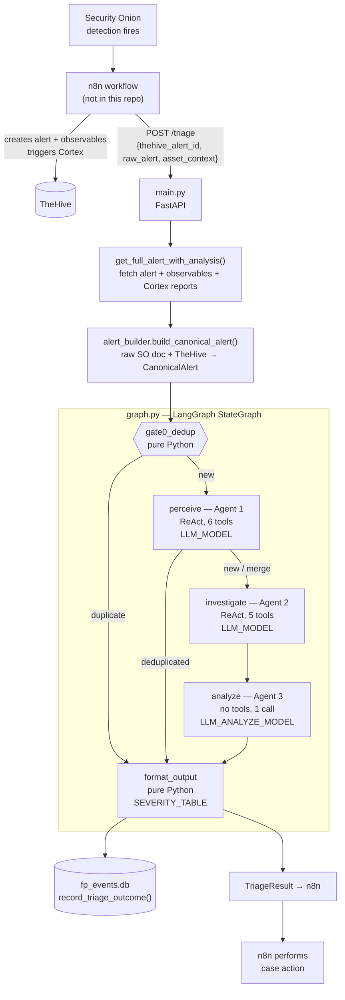

# Agent-Service — Full Pipeline Audit

**Date:** 2026-08-07
**Scope:** Entire `agent-service` codebase, audited against the live TrustShield stack
(Security Onion ES `172.20.24.58`, TheHive `172.20.24.221`, iTop `172.20.24.223`,
Qdrant `172.20.24.224`, Ollama `172.20.24.225`).
**Method:** Static read of all 24 source modules + live verification against production
backends + analysis of three real triage runs of alert `~1190993992` (2026-08-07 01:54–02:02).

> Findings marked **[VERIFIED]** were reproduced against the live stack during this audit.
> Findings marked **[OBSERVED]** come from the three production triage runs.
> Findings marked **[CODE]** are read from source without live reproduction.

---

## 1. Executive summary

The architecture is sound. The severity table, the Agent-2/Agent-3 prompt-injection
firewall, and the "every LLM node degrades safely" invariant are all correctly
implemented. **The problem is not the design — it is that the pipeline is currently
running blind and does not know it.**

One configuration typo (`ES_URL` missing its port) silently disables **every**
Elasticsearch-backed tool. Because every tool in this codebase converts failure into
an empty list, the agents cannot distinguish *"I searched and found no threat"* from
*"my search never reached the database."* They interpret infrastructure failure as
evidence of absence, and the Analyst — reasoning correctly over what it was given —
concludes there is nothing there.

The result, observed in production: **a credential-dumping tool download was
auto-closed as a false positive, twice.**

That verdict was then written back into the FP-tracking database, which feeds the
next triage of the same rule. The system is currently teaching itself that this
attack is benign.

**Three findings block production use. They are P0-1, P0-2, and P0-3 below.**

---

## 2. The pipeline as built

### 2.1 End-to-end flow



### 2.2 Stage reference

| # | Stage | File | LLM | Tools | Purpose |
|---|---|---|---|---|---|
| 0 | Ingest | `main.py` | — | — | Validate `AlertWebhookPayload`, fetch TheHive alert |
| 1 | Normalize | `alert_builder.py` | — | — | Raw SO doc (5 Sigma shapes + Suricata + YARA) → `CanonicalAlert` |
| 2 | Gate 0 | `nodes/perceive.py::gate0_dedup` | — | — | SHA-256 fingerprint in Redis, `DEDUP_WINDOW_SECONDS` |
| 3 | Perceive | `nodes/perceive.py::perceive` | fast | 6 | MITRE mapping + open-case correlation |
| 4 | Investigate | `nodes/investigate.py` | fast | 5 | Build `EvidencePackage` / `DeltaEvidence` |
| 5 | Analyze | `nodes/analyze.py` | quality | 0 | `likelihood` + `impact_if_true` + verdict |
| 6 | Format | `nodes/format_output.py` | — | — | Severity lookup, `TriageResult`, FP record |

### 2.3 Tool ownership (enforced disjoint by assertion in `registry.py:214-217`)

| Agent 1 — perceive | Agent 2 — investigate |
|---|---|
| `get_fp_signal` | `thehive_search_closed` |
| `thehive_fp_history` | `elasticsearch_query` |
| `detection_rule_lookup` | `itop_asset_lookup` |
| `qdrant_retrieve_mitre` | `qdrant_retrieve` (cve/playbooks) |
| `thehive_open_cases` | `cortex_analyze` |
| `get_case_full` | |

### 2.4 Severity is computed, never generated

`format_output.py:6-23` maps `(likelihood, impact_if_true) → severity`. The LLM never
emits severity directly. **This invariant is correctly implemented and should be
preserved.**

---

## 3. Findings

### P0-1 — Elasticsearch is unreachable for **two** independent reasons; every ES tool is silently dead **[VERIFIED]**

Both must be fixed. Fixing either one alone leaves the pipeline just as blind.

**(a) `ES_URL` is missing its port.** `.env` line 12:

```bash
ES_URL=https://172.20.24.58        # ← no :9200
```

Port 443 is the Security Onion **web UI**, not the Elasticsearch API.

**(b) TLS verification is never disabled or pinned.** `tools/elasticsearch.py:21-29`
(`_es_post`) and `:14-18` never pass `verify=`, so `requests` defaults to `verify=True`.
Security Onion ships a **self-signed** certificate, so the handshake fails outright.

Full matrix, run live during this audit:

| URL | `verify` | Result |
|---|---|---|
| `https://172.20.24.58` | `True` (current default) | **`SSLError`** |
| `https://172.20.24.58` | `False` | 200 — but returns **HTML** (the SO web UI) |
| `https://172.20.24.58:9200` | `True` | **`SSLError`** |
| `https://172.20.24.58:9200` | `False` | **200 `{"count":74944}`** ← only working combination |

The live exception from the service's own code path today:

```python
>>> _es_post('/.ds-logs-detections.alerts-so-*/_search', {'size': 1})
requests.exceptions.SSLError          # isinstance(e, RequestException) is True
```

`SSLError` subclasses `RequestException`, so it is caught by the `except` block at
`:82`, `:125`, `:170` and converted to `[]`. **A TLS failure is reported to the agents as
"no security events found."**

**Blast radius — every ES-backed tool, in both agents:**

| Tool | Agent | Actual behaviour today |
|---|---|---|
| `detection_rule_lookup` | 1 | always `{"found": false}` → **no MITRE mapping, ever** |
| `elasticsearch_query(alerts)` | 2 | always `[]` |
| `elasticsearch_query(process)` | 2 | always `[]` |
| `elasticsearch_query(connections)` | 2 | always `[]` |
| `perceive._extract_techniques_from_rule` | 1 | always `set()` → **story-match correlation can never fire** |

This is the single root cause of `"mitre_mapping": []` in all three production runs.

**Proof the data was there the whole time.** With only the port corrected, the exact
same lookup for the exact same rule returns:

```
found:          True
title:          Suspicious Invoke-WebRequest Execution
mitre_attack:   ['T1105']              ← Ingress Tool Transfer
mitre_tactics:  ['command-and-control']
level:          high
falsepositives: ['Unknown']            ← Sigma author states no known FP condition
```

T1105 is exactly correct for `Invoke-WebRequest … -OutFile xordump.exe`.

**Fix — both parts:**

```bash
# .env
ES_URL=https://172.20.24.58:9200
ES_VERIFY_TLS=false          # or point at Security Onion's CA bundle
```

```python
# tools/elasticsearch.py — thread a verify setting through _es_post()
requests.post(..., verify=ES_VERIFY)
```

Preferred production form is `verify="/path/to/so-ca.crt"` rather than `False`, so the
connection stays authenticated. `verify=False` is acceptable only on a trusted
management segment, and should be an explicit, named config value — never an
undocumented default.

> ⚠️ Do not ship this alone — it activates the latent crash in **P1-6**. Apply P1-4,
> P1-5 and P1-6 in the same change.

---

### P0-2 — The FP-tracking loop is poisoning itself **[VERIFIED]**

`format_output.py:90-95` records every triage outcome unconditionally:

```python
record_triage_outcome(
    rule_uuid=...,
    host=...,
    is_fp=verdict.verdict == "false_positive",
    verdict_confidence=verdict.likelihood,
)
```

There is no gate on evidence quality, no gate on analyst confirmation. The LLM's
verdict is written straight to the database that `get_fp_signal` reads on the *next*
triage of the same rule/host — which `prompts/perceiver.py:33` instructs Agent 1 to
call **first, before anything else**.

**Live database state right now:**

```
total rows=4  is_fp rows=2
  5e3cc4d8-3e68-43db-8…  host=win-kvkmd51ggkq  is_fp=1  2026-08-07T01:02:29
  5e3cc4d8-3e68-43db-8…  host=win-kvkmd51ggkq  is_fp=1  2026-08-07T01:00:34
  5e3cc4d8-3e68-43db-8…  host=win-kvkmd51ggkq  is_fp=0  2026-08-07T00:58:38
  5e3cc4d8-3e68-43db-8…  host=win-kvkmd51ggkq  is_fp=0  2026-08-06T22:28:24
```

A **50% long-term FP rate is already recorded** for the xordump credential-dumping
rule on this host — created entirely by two evidence-free verdicts that were themselves
caused by P0-1.

The loop is self-reinforcing:

```
broken ES → empty evidence → "false_positive" → is_fp=1 written
   → next run's get_fp_signal reports elevated FP rate
      → Agent 1 primed toward FP → verdict more likely FP → is_fp=1 written …
```

At 5 samples with rate > 0.5, `thehive_fp_history` also unlocks (`fp_tracking.py:102`),
compounding the prior with narrative "this was closed before" text.

**Fix (defence in depth, all three):**
1. Do not record when the evidence package is empty — no `rule_context`, no
   `asset_context`, no `threat_intel`, and `investigation_gaps` contains the
   "did not produce structured JSON" marker.
2. Do not record `is_fp=1` from `needs_review`, or from any verdict whose
   `likelihood == "unlikely"` *and* whose evidence is empty.
3. Purge the 2 poisoned rows for `5e3cc4d8-3e68-43db-8656-eaaeefdec9cc`.

Longer term the FP signal should be fed by **analyst-confirmed** closures (TheHive
`Ignored` status), not by the model's own unreviewed output. `case_action.py` already
models the human-approval path — the FP write belongs there, not in `format_output`.

---

### P0-3 — `close_fp` is reachable on an empty evidence package **[OBSERVED]**

Runs 2 and 3 returned:

```json
{ "verdict": "false_positive", "action": "close_fp", "severity": "low",
  "reasoning": "No evidence provided to support any claims; all fields in
                evidence_package_summary are empty or null" }
```

The Analyst's reasoning is *self-refuting and honest* — it says plainly that it has no
evidence — yet the pipeline emitted the most destructive available action. n8n acts on
`TriageResult.action`, so this closes a real credential-dumping alert in TheHive.

`prompts/analyst.py:52` explicitly instructs: *"'I don't know' expressed as
needs_review is CORRECT."* The model violated its own instruction, which is exactly
why this must be enforced **in code**, matching the pattern already used in
`fp_tracking.py:102` (threshold gating enforced defensively rather than trusted to the
prompt).

**Fix — add a structural floor in `format_output.py`,** before the severity lookup:
if the evidence package is empty or carries the JSON-fallback gap marker, force
`verdict = needs_review` / `action = needs_review` regardless of what the Analyst said.
An empty evidence package must make `close_fp` **unreachable**, not merely discouraged.

---

### P1-4 — Two of three ES index patterns match nothing **[VERIFIED]**

`tools/elasticsearch.py` hardcodes index patterns that do not exist on this deployment:

| Code | Line | Live result | Reality |
|---|---|---|---|
| `.ds-logs-endpoint.process-*` | `:111` | `count=0`, **0 shards** | real: `.ds-logs-endpoint.events.process-*` |
| `.ds-logs-network.flow-*` | `:154` | `count=0`, **0 shards** | **no Zeek indices exist at all** (`*zeek*` → 0) |
| `.ds-logs-detections.alerts-so-*` | `:79` | `count=7718` ✅ | correct |

"0 shards" is conclusive — the pattern matches zero indices, not zero documents.

The raw alert n8n sent confirms the true name:
`"_index": ".ds-logs-endpoint.events.process-default-2026.07.05-000004"` — the code is
missing the `.events` segment.

For connections, there is no Zeek data on this stack; the nearest equivalent is
`.ds-logs-endpoint.events.network-*` (Elastic Defend network events).

---

### P1-5 — Query field names don't match the live mapping **[VERIFIED]**

`_field_caps` against the real indices:

| Field used in code | Process index | Alerts index |
|---|---|---|
| `src_ip`, `dst_ip` | **MISSING** | **MISSING** |
| `source.ip`, `destination.ip` | EXISTS | MISSING |
| `username` | **MISSING** | **MISSING** |
| `user.name` | EXISTS | **MISSING** |
| `host.hostname` | EXISTS | **MISSING** |

Worse — on the alerts index the entity fields are **null at the top level**; the real
values live one level down:

```json
{ "host": null, "user": null,
  "event_data": { "host": {"hostname": "WIN-KVKMD51GGKQ"},
                  "user": {"name": "Administrator"} } }
```

So `query_related_alerts` must filter on `event_data.host.hostname` and
`event_data.user.name`. As written, **every host/user filter matches nothing even
after P0-1 is fixed.**

---

### P1-6 — Latent `AttributeError` that P0-1 is currently masking **[VERIFIED]**

`elasticsearch.py:43`:

```python
"hostname": src.get("host", {}).get("hostname", src.get("hostname", "")),
```

The default `{}` only applies when the key is **absent**. On real alert docs the key is
**present with value `null`**, so `.get()` returns `None`:

```python
>>> {'host': None}.get('host', {})
None
>>> _.get('hostname')
AttributeError: 'NoneType' object has no attribute 'get'
```

`AttributeError` is not a `RequestException`, so the `except` block does not catch it —
it propagates out of the tool. Today this never fires because P0-1 guarantees zero hits.
**Fixing `ES_URL` without fixing this will convert silent-empty into a hard tool error.**

Same pattern at `:44`. Use `(src.get("host") or {})`.

---

### P1-7 — Every tool converts failure into "no findings" **[CODE]**

A systemic design flaw, and the reason P0-1 stayed invisible for so long:

| Module | Failure handling |
|---|---|
| `elasticsearch.py` ×3 | `except RequestException: return []` |
| `thehive.py` ×5 | `except RequestException: return []` / `None` |
| `qdrant.py` | `except Exception: return []` ← catches *everything* |
| `itop.py` | returns `{"found": False}` |
| `cortex.py` | returns `verdict: "unknown"` ✅ *(correct — distinguishes)* |

`cortex.py` is the model to follow: it returns an explicit `"unknown"` verdict with the
error text in `details`, so a downstream reader can tell "analyzer said clean" from
"analyzer unreachable."

Everywhere else, an unreachable backend is indistinguishable from a clean result. **In a
SOC, "I couldn't check" and "there's nothing there" must never be the same value** —
that difference is the whole basis of the verdict.

**Fix:** return a structured envelope (`{"status": "error"|"ok", "data": [...],
"error": "..."}`) or at minimum append to `investigation_gaps`, so tool failures reach
the Analyst as *gaps* rather than as *absence of threat*.

---

### P1-8 — Fallback path discards evidence the service already has **[OBSERVED]**

`investigate.py:113` — `_build_from_tool_results(messages, trace)` receives only tool
output. It never receives `state["canonical_alert"]`, which `investigate()` already
holds at line 27, so it initialises `rule_context: {}` and can never fill it.

Everything below is known **before any tool call** and is thrown away on the fallback path:

- `rule.name` = "Suspicious Invoke-WebRequest Execution"
- `rule.uuid`, `rule.native_severity` = 4, `sigma_level` = high
- `process.command_line` — the literal string containing `xordump.exe`
- `observables.hashes.sha256`, the parent-process chain, `user.name`

Result: the Analyst receives `rule_context: {}` and reports "no actionable data" about
an alert whose own command line names a credential-dumping tool.

**Fix:** pass `alert` into `_build_from_tool_results` and seed `rule_context` and the
process/observable context from it. A JSON-parse failure should degrade to *partial*
evidence, never to *zero* evidence.

---

### P1-9 — `/triage` is unauthenticated and blocks the event loop **[VERIFIED]**

**No auth.** `main.py:35` — no API key, no network restriction. Anything that can reach
port 8000 can inject arbitrary `raw_alert` content straight into both agents' prompts.
Given Agent 1 receives `json.dumps(alert.model_dump())` verbatim, this is a direct
prompt-injection surface into a system that recommends case actions.

**Blocking call in async handler.** `async def triage(...)` calls the *synchronous*
`graph.invoke()` at line 60. This blocks the single uvicorn event loop for the entire
2–17 minute run, serializing all concurrent requests.

Observed directly during this audit: a `GET /health` issued at 01:58 did not return
until 02:02:29 — it sat behind n8n's queued `/triage` calls for **4½ minutes**. Three
n8n connections were visibly stacked in `ss` output.

**Fix:** `def triage(...)` (FastAPI runs sync handlers in a threadpool), or
`await asyncio.to_thread(graph.invoke, initial_state)`. Add an API key. Consider the
async callback pattern — n8n's 90s HTTP timeout cannot accommodate a 2–17 min pipeline
regardless.

---

### P1-10 — Redis dedup disabled, so every alert is replayed in full **[OBSERVED]**

`REDIS_URL` is unset, so `_check_dedup` returns `False` unconditionally
(`perceive.py:122-123`) and Gate 0 never fires. n8n retried alert `~1190993992` three
times in eight minutes; each retry ran the complete 3-agent pipeline.

This is also what made the P0-2 poisoning worse — three passes wrote three rows for one
alert, two of them `is_fp=1`.

Note the interaction with P1-9: because dedup no-ops *and* the handler is blocking, n8n's
timeout-driven retries queue up behind the very request they are retrying.

---

### P2-11 — Agent 1 makes zero tool calls **[OBSERVED]**

Across all three runs, `perceive` issued exactly **one** LLM call and stopped — no tool
invocation at all, despite the prompt mandating `get_fp_signal` "FIRST, before anything
else" and `detection_rule_lookup` for MITRE.

Log signature, identical in each run:

```
01:54:53 Triage request received
01:55:51 POST …/chat/completions 200 OK      ← one call only
01:55:51 [WARNING] Perceive agent JSON unparseable, falling back to deterministic
```

Contrast `investigate`, which made 4 calls and did invoke tools — so tool-calling works
against this Ollama endpoint in general. Candidate causes, in order of likelihood:

1. `prompts/perceiver.py` is ~120 lines of dense instruction ending in a strict
   "output ONLY JSON" directive — the smaller `qwen3.5:4b` likely satisfies the final
   instruction immediately and skips the tool phase.
2. `qwen3.5:4b` is weaker at multi-step ReAct than the `qwen3:8b` it replaced.
3. `<think>` blocks from qwen3 breaking `_try_parse_json`'s brace extraction
   (`perceive.py:346-353` takes `find("{")` → `rfind("}")`, which spans a reasoning
   block if one contains braces).

**Worth testing first:** point `perceive` back at `qwen3:8b` and compare — it is a
one-line config change and cleanly separates cause 2 from cause 1.

---

### P2-12 — Tool budget declared inconsistently in three places **[CODE]**

| Location | Value |
|---|---|
| `prompts/perceiver.py:25` | "Budget: at most 6 tool calls" |
| `perceive.py:28` | `PERCEPTION_MAX_TOOL_CALLS = 7` |
| `perceive.py:165` | `recursion_limit = 7*4+15 = 43` |

Agent 1 also has exactly 6 tools, so "6 calls" reads as "one call per tool" and leaves
no budget for a retry — which the same prompt explicitly permits at line 84 ("fix it and
retry ONCE"). The `×4+15` multiplier means the true ceiling is ~43 graph steps, far
above either stated number. Align all three.

---

### P2-13 — iTop: injectable OQL, admin credentials, and one asset class **[CODE]**

`itop.py:39`:

```python
"key": f"SELECT Server WHERE (name = '{hostname_or_ip}' OR ip = '{hostname_or_ip}')",
```

- **OQL injection** — `hostname_or_ip` is interpolated unescaped. It originates from
  alert data, i.e. from a potentially attacker-controlled endpoint hostname. A single
  quote breaks the query; crafted input alters it.
- **Admin credentials** — `.env` uses `ITOP_USER=admin` with a full-privilege password
  for what is a strictly read-only lookup. Create a read-only iTop account.
- **Class coverage** — only `Server` is searched. Both live lookups failed
  (`"No asset found"` for `win-kvkmd51ggkq` *and* `172.20.24.99`), so asset context was
  empty in every run. iTop also has `PC`, `VirtualMachine`, `NetworkDevice`. Either
  query `FunctionalCI` (the parent class) or try several.

---

### P2-14 — `FP_DB_PATH` / `FP_TRACKING_DB_PATH` env-var mismatch **[VERIFIED]**

`.env:35` sets `FP_TRACKING_DB_PATH`; `config.py:56` reads `FP_DB_PATH`. Neither is
present in the environment, so the hardcoded default `./data/fp_events.db` applies —
which happens to equal the `.env` value, so it works **by coincidence**. Anyone editing
`.env` to relocate the database will find the change silently ignored. Pick one name.

Related: `FP_DB_PATH` is relative, so the database resolves against the process CWD.
Started from a different directory, the service gets a *different, empty* FP history.

---

### P2-15 — Secrets are committed to the repository **[VERIFIED]**

`.env` contains live production credentials in plaintext — Cortex, TheHive, ES API keys
and the iTop admin password — and is tracked in git. They are in the history of a repo
with a GitHub remote. **Rotate all four, add `.env` to `.gitignore`, ship a
`.env.example` instead.**

---

### P2-16 — Cortex results are assumed present but were empty **[VERIFIED]**

`prompts/investigator.py:35` tells Agent 2 the alert "already carries pre-fetched Cortex
reports." For alert `~1190993992` that was false — all four observables returned
`reports: {}`.

The retrieval mechanism itself is **correct** (`thehive.py:197-229` requests
`extraData: ["reports"]` and it works); Cortex simply had not run yet when `/triage`
was called. The prompt then actively discourages Agent 2 from filling the gap itself.

Separately, the observables n8n created are malformed — a full PowerShell command line
stored with `dataType: url`, and a URL stored with `dataType: domain`. The actual
malicious URL (`github.com/audibleblink/xordump/…/xordump.exe`) exists **only** as a
substring inside the mangled entry, never as its own observable. That is an n8n Alert
Builder defect, outside this repo, but it means even a correct `cortex_analyze` call
would have had garbage input for 2 of 4 observables.

---

### P3 — Lower priority

- **`prompts/analyst.py:121` GBNF grammar is dead code.** A well-formed grammar that
  would largely eliminate the JSON-parse failures — but `grammar()` is never called, and
  Ollama's OpenAI-compatible endpoint wouldn't accept it. Ollama *does* support
  `format: "json"`; wiring that into `ChatOpenAI(model_kwargs={"format": "json"})` is
  the practical equivalent.
- **`nodes/case_action.py` write paths are unverified** against live TheHive (documented
  honestly at `thehive.py:259-263`). Verify before enabling.
- **`analyze.py:23` `_truncate` is defined but never used.**
- **No structured logging / trace IDs.** With concurrent alerts the log lines cannot be
  correlated to a specific triage run.
- **`test.sh` references a missing `requirements-dev.txt`** (already noted in `CLAUDE.md`).

---

## 4. Why one typo produced a wrong verdict

```
ES_URL missing :9200  +  verify=True vs self-signed cert   [P0-1]
   │   (SSLError → caught as RequestException → [])
   │
   ├─→ detection_rule_lookup → {"found": false}
   │      └─→ mitre_mapping: []  (T1105 was available all along)
   │
   ├─→ elasticsearch_query ×3 → []   (also wrong patterns/fields [P1-4][P1-5])
   │      └─→ temporal_context: {}
   │
   └─→ itop_asset_lookup → not found  (Server-only [P2-13])
          └─→ asset_context: {}
                     │
                     ▼
        Agent 2 emits prose, not JSON            [P2-11 family]
                     │
                     ▼
        _build_from_tool_results() discards
        rule name + command line + hashes        [P1-8]
                     │
                     ▼
        Analyst receives a fully empty package
        → "no evidence" → false_positive         [P0-3]
                     │
                     ▼
        format_output writes is_fp=1             [P0-2]
                     │
                     ▼
        Next run of this rule starts biased toward FP  ← self-reinforcing
```

Every safety net in the chain degraded *silently and in the same direction*: toward
"nothing to see here." Nothing in the pipeline ever said **"I could not check."**

---

## 5. Recommended order of work

**Ship together as one change — fixing P0-1 alone activates P1-6:**

1. **P0-1** `ES_URL=https://172.20.24.58:9200` **and** thread a `verify=` setting
   through `_es_post` (CA bundle preferred, `False` acceptable on a trusted segment)
2. **P1-4** `.ds-logs-endpoint.events.process-*`; replace the non-existent Zeek pattern
   with `.ds-logs-endpoint.events.network-*`
3. **P1-5** `source.ip` / `destination.ip` / `user.name`; `event_data.host.hostname` on
   the alerts index
4. **P1-6** `(src.get("host") or {})` in `_summarize_hits`

**Then, before any further production traffic:**

5. **P0-3** Structural floor — empty evidence ⇒ `needs_review`, `close_fp` unreachable
6. **P0-2** Gate the FP write on evidence quality; purge the 2 poisoned rows
7. **P1-8** Pass `canonical_alert` into `_build_from_tool_results`

**Then hardening:**

8. **P1-9** Non-blocking handler + API key on `/triage`
9. **P1-7** Structured tool-failure envelope so gaps ≠ absence
10. **P1-10** Deploy Redis, or fingerprint-dedup in SQLite alongside `fp_events`
11. **P2-11** Test `perceive` on `qwen3:8b`; enable Ollama `format: "json"`
12. **P2-15** Rotate credentials, `.gitignore` the `.env`

**Regression tests worth adding:**

- Empty `EvidencePackage` ⇒ verdict is never `false_positive` (locks P0-3)
- Empty evidence ⇒ `record_triage_outcome` not called (locks P0-2)
- `_summarize_hits` handles `{"host": None, "user": None}` (locks P1-6)
- `_build_from_tool_results` output contains `rule.name` (locks P1-8)
- Index-pattern constants asserted against a recorded live `_cat/indices` fixture

---

## 6. What is working well

Worth stating plainly, because the failure above is a configuration and plumbing
problem, not an architectural one:

- **Severity computation** (`format_output.py:6-23`) — correctly table-driven, never
  model-generated. Invariant held.
- **The Agent 2 → Agent 3 firewall** — the Analyst genuinely never sees raw tool output;
  `_summarize_evidence` truncates and types everything. Prompt-injection boundary intact.
- **Tool-list disjointness** — enforced by a runtime assertion, not just convention.
- **`alert_builder.py`** — handles all five Sigma `event_data` shapes plus Suricata and
  YARA; produced a correct `CanonicalAlert` from the real n8n payload in every run.
- **Null-argument tool handling** — the recent `Optional` fix works; live traces show
  clean `elasticsearch_query` calls with omitted parameters and no validation errors.
- **`cortex.py`'s error model** — the one tool that distinguishes "unknown" from
  "clean." Use it as the template for P1-7.
- **The two-model split** — `qwen3:8b` on analyze produced parseable JSON on the first
  attempt in all three runs, while cutting end-to-end latency from ~17 min to ~2 min.
- **Fallback discipline** — no node ever 500'd, across every failure mode observed here.
  The degradation was *too quiet*, but it never crashed.
